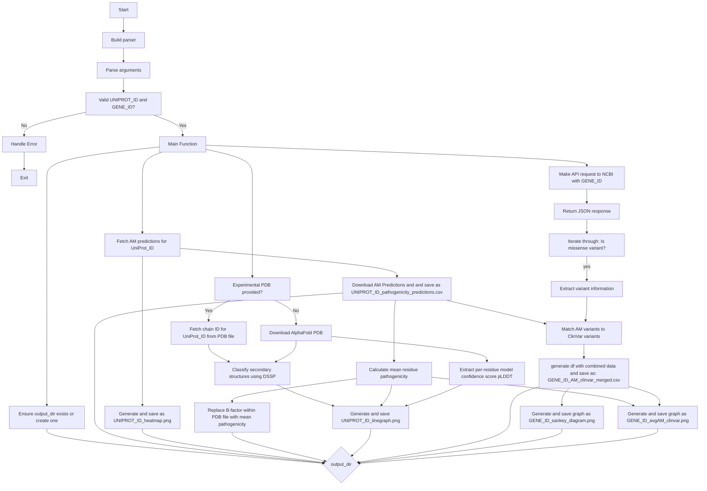

# Protein Pathogenicity Analysis Tool

This project offers an accessible script to analyse and visualize AlphaMissense-predicted pathogenicity scores. \
It integrates with ClinVar and AlphaFold to promote a more comprehensive interpretation of the pathogenicity predictions.

## Features

- Fetches and processes AlphaMissense predictions for specified protein (based on uniprot ID)
- Automatically fetches AlphaFold PDB files or utilizes user-provided experimental PDB files to generate a modified PDB file with AlphaMissense pathogenicity scores
  - Replaces the temperature factor (B-factor) with pathogenicity values, enabling visualization in molecular visualization tools
- Creates a heatmap with the AlphaMissense predicted pathogenicity scores for all amino acid residue substitutions
- Produces a line graph visualizing:
  - Average AlphaMissense predicted pathogenicity at each amino acid residue
  - AlphaFold per-residue model confidence score (pLDDT)
  - Secondary structure annotations for alpha helices and beta sheets
- Produces another line graph visualizing:
  - Average AlphaMissense predicted pathogenicity at each amino acid residue
  - Extracted reported missense variants from ClinVar along with their associated classification (simplified for plot simplicity)

## Requirements

- Python 3.11 or higher
- Required Python packages:
  - requests 
  - pandas 
  - seaborn 
  - matplotlib 
  - plotly 
  - numpy 
  - biopython 
  - kaleido

You can install the required packages using: \
`pip install -r requirements.txt`

DSSP is required for secondary structure prediction. Install it on a Mac using: \
`brew install brewsci/bio/dssp`

The script uses the following custom modules:
  - `helpers.clinvar`: to fetch ClinVar data. 
  - `helpers.graphs`: to produce graphs. 
  - `helpers.pdb`: to produce a modified PDB file. 

## Usage
Clone the repository: \
`git clone https://httpsgithub.com/halbritter-lab/Amissense.git`

Run the **'amissense.py'** script: \
`python amissense.py UNIPROT_ID GENE_ID --output_dir out --experimental_pdb EXPERIMENTAL_PDB.pdb`

Arguments:
- `UNIPROT_ID`: The UniProt ID of the protein you want to analyze. This is a required positional argument.
- `GENE_ID`: The gene ID associated with the protein. This is a required positional argument.
- `EXPERIMENTAL_PDB`: The experimental PDB for the protein (as a .pdb), if not provided the script will use the AlphaFold predicted structure. This is an optional positional argument.

## Output

The script generates several output files in the `out/` directory:

- `{UNIPROT_ID}_heatmap.png`: Heatmap of the AlphaMissense pathogenicity scores for each amino acid substitution
- `{UNIPROT_ID}_line_graph.png`: Line graph showing the AlphaMissense mean pathogenicity, AlphaFold per-residue model confidence score (pLDDT) and secondary structure annotations
- `{UNIPROT_ID}_pathogenicity.pdb`: PDB file with pathogenicity scores within the B-factor
- `{UNIPROT_ID}_pathogenicity_predictions.csv`: CSV file containing the AlphaMissense predictions
- `{GENE_ID}_MAKE A NEW VERSION.csv`: CSV file with ClinVar and AlphaMissense data combined
- `{GENE_ID}_avgAM_clinvar.png`: Line graph showing the AlphaMissense mean pathogenicity, extracted ClinVar missense variants with their classification (simplified)
- `{GENE_ID}_sankey_diagram.png`: Sankey diagram depicting the flow quantity between the AlphaMissense variant pathogenicity classification and the ClinVar variant classifications

## Diagram

## License
[Specify license here?]

